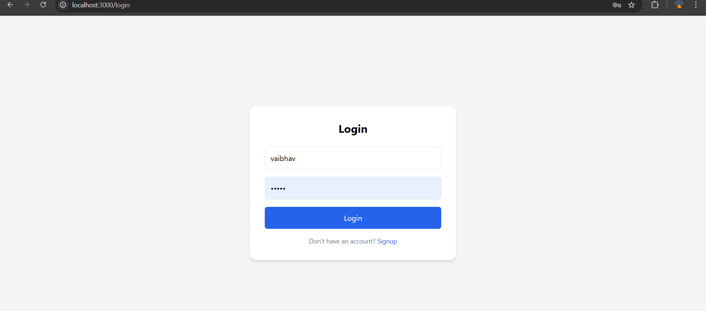
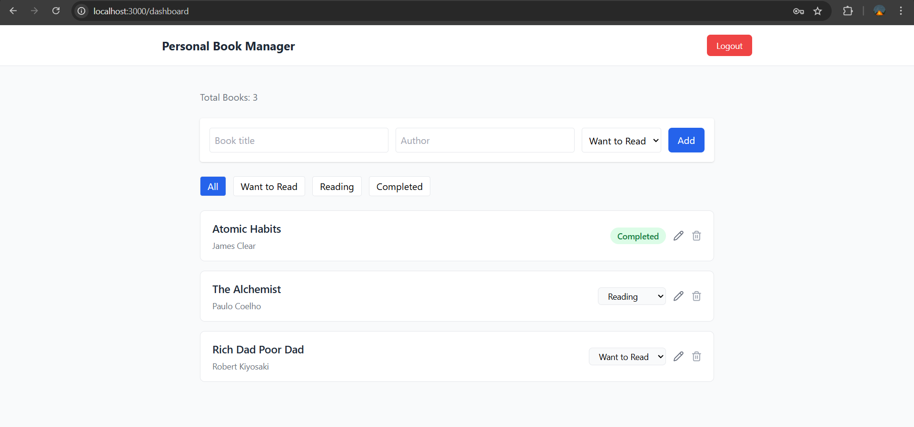

Personal Book Manager
Personal Book Manager is a simple full-stack application where users can maintain their own reading list.
It allows users to sign up, log in securely, and manage books they want to read, are currently reading, or have already completed.

The goal of this project was to build a clean and intuitive reading tracker using the MERN stack while keeping the user experience simple and focused.

Features
Secure user authentication using JWT
Sign up and login functionality
Add books to your personal collection
Edit existing books
Delete books from the collection
Track reading progress
Filter books based on reading status
Minimal and clean dashboard interface
Reading status options:

📖 Want to Read
📘 Reading
✅ Completed
Tech Stack
Frontend

Next.js
Tailwind CSS
Backend

Node.js
Express.js
Database

MongoDB
Authentication

JWT (JSON Web Token)
Project Structure
personal-book-manager │ ├── client # Next.js frontend ├── server # Express backend ├── screenshots # Project screenshots │ ├── .env.example ├── README.md └── package.json

Screenshots
### Login Page

### Dashboard

### Editing a Book

### filtering a booklist

Running the Project Locally
Clone the repository:

git clone https://github.com/VaibhavTi/personal-book-manager.git

cd personal-book-manager

Backend Setup
Navigate to the server folder:

cd server npm install npm run dev

The backend will run on:

http://localhost:5000

Frontend Setup
Open a new terminal and navigate to the client folder:

cd client npm install npm run dev

The frontend will run on:

http://localhost:3000

Environment Variables
Create a .env file inside the server folder and add the following variables:

PORT=5000 MONGO_URI=your_mongodb_connection_string JWT_SECRET=your_secret_key

You can refer to .env.example for the required format.

Possible Future Improvements
Some ideas that could improve the project further:

Add tags to categorize books
Search books by title or author
Pagination for large book collections
Dark mode support
Deployment (Vercel + MongoDB Atlas)
Author
Vaibhav Tiwari

After adding this README

Run these commands to push:

git add . git commit -m "docs: update README and add project screenshots" git push